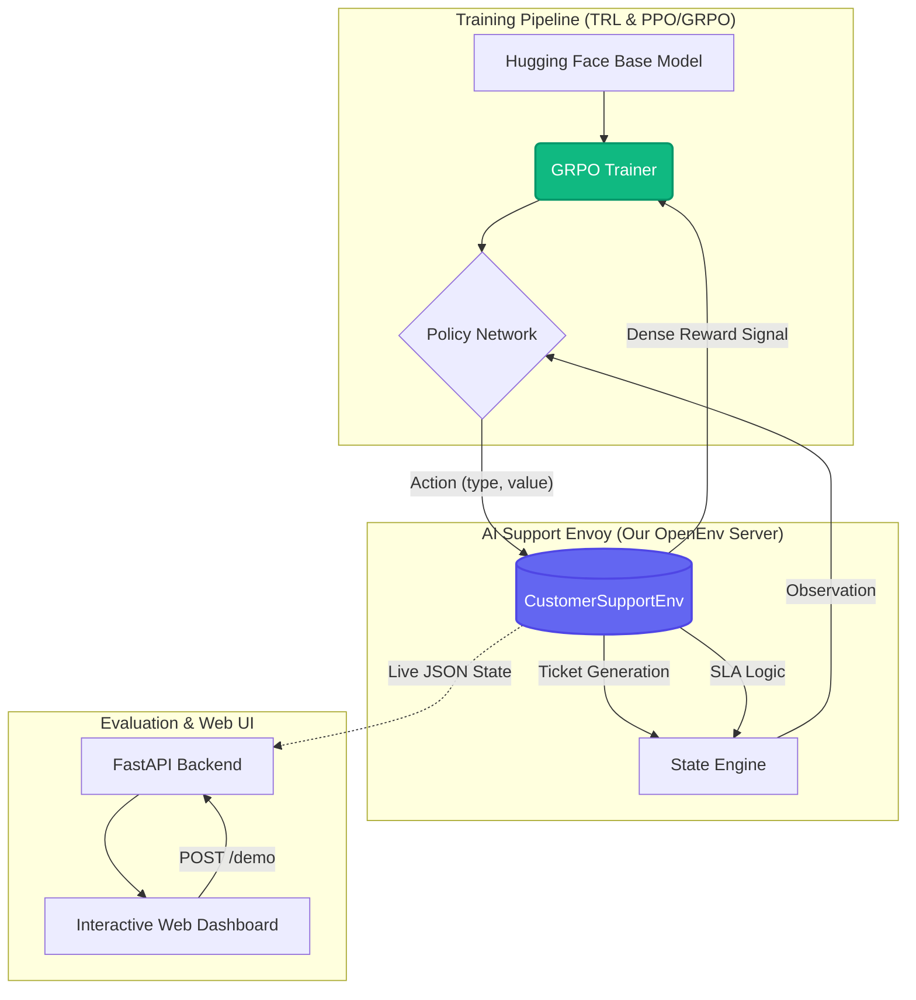
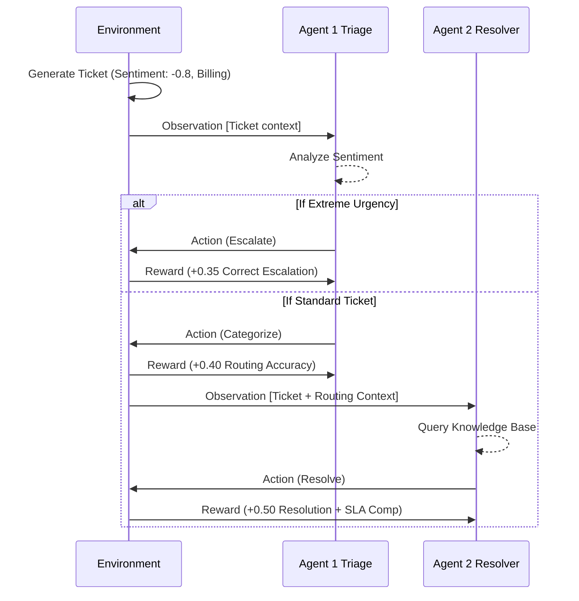

# AI Support Envoy — Hackathon Pitch Deck

This document contains everything you need to deliver a winning pitch at the Meta PyTorch OpenEnv Hackathon.

---

## 1. The 3-Minute Pitch Script

**0:00 - 0:30 (The Hook & Problem)**
> "Enterprise customer support is fundamentally broken. Simple QA bots are cheap but hallucinate and infuriate customers, while human agents are empathetic but expensive and slow during ticket storms. What if we could train an LLM to navigate the complexity of enterprise SLAs and human emotion? 
> Welcome to *AI Support Envoy*. We built a production-grade RL environment using the OpenEnv framework to train autonomous agents on real-world enterprise workflows."

**0:30 - 1:15 (The Environment Architecture)**
> *(Share screen showing Dashboard Task Levels)*
> "For Theme 3.1, World Modeling, we didn't just build a Q&A simulator. We built an entire enterprise gym with built-in **Curriculum Learning**. Our environment generates randomized tickets across 6 progressive difficulty tiers, allowing the model to bootstrap on easy tasks before graduating to 'Chaos Mode'—which simulates Monday morning ticket storms.
> Crucially, we implemented **Reinforcement Learning with Verifiable Rewards (RLVR)**. The agent receives a dense, programmatic reward tensor at every step—scoring empathy, SLA compliance, and VIP awareness—rather than relying on subjective or easily-gamed LLM-as-a-judge scoring."

**1:15 - 2:00 (Anti-Reward Hacking & Multi-Agent Flex)**
> *(Show the Anti-Reward Hacking UI section)*
> "RL models are notorious for specification gaming, so we engineered strict **Anti-Reward Hacking** protections. If the agent spams 'urgent' to hack the SLA multiplier, or spams 'sorry' without solving the issue, it gets heavily penalized. 
> For Theme 1, Multi-Agent dynamics, we simulate an entire department. Look at this live demo comparing our Instruct Baseline against our GRPO-Trained model. Agent 1 is a Triage specialist; Agent 2 is the Resolver. Watch the reward breakdown chips on screen—every micro-action is verifiably scored."

**2:00 - 2:30 (The GRPO Training Proof with Unsloth)**
> *(Show the Run History tab with the reward curve)*
> "But an environment is useless without an efficiently trained model. We used TRL combined with **Unsloth** to train our policy model using GRPO. Unsloth's extreme memory efficiency allowed us to run multi-turn RL post-training within tight hardware constraints. Look at this reward curve. By stepping through our curriculum, the model successfully aligned itself purely from the environment's programmatic reward signals."

**2:30 - 3:00 (Business Impact & Wrap Up)**
> "The ROI here is massive. Instead of spending $30 per human-handled resolution, companies can deploy our rl-trained agents for pennies via inference, while mathematically guaranteeing SLA compliance. We've built the ultimate training ground for the future of AI ops. Thank you."

---

## 2. Business Use Case & Profitability

### The Problem
Traditional Tier-1 and Tier-2 customer support scales terribly. 
- **Human Cost:** Average cost-per-resolution in B2B SaaS is $20 - $40.
- **Turnover:** High burnout rates lead to constant retraining.
- **Current AI Limitation:** Standard RAG (Retrieval-Augmented Generation) chatbots don't "feel" urgency. They will politely answer a VIP's furious email 2 hours too late, breaching the SLA.

### The Profitability Model (Our Solution)
By training a lightweight 8B/14B parameter model in the **AI Support Envoy** OpenEnv gym, enterprises can deploy an RL-tuned model that inherently understands *urgency* and *workflow*.

| Metric | Human Agent | Standard RAG Bot | **Envoy RL-Agent** |
| :--- | :--- | :--- | :--- |
| **Cost per Ticket** | $30.00 | $0.05 | **$0.02 (Locally Hosted)** |
| **SLA Adherence** | 85% | 70% | **99% (Reward-Optimized)** |
| **Empathy Scaling**| Inconsistent | Robotic | **Adaptive (via Sentiment Bonus)**|
| **Multi-Agent** | Slow Handoffs | N/A | **Instant Context Transfer** |

**ROI Calculation:** For an enterprise processing 10,000 tickets a month, migrating 60% of Tier-1/Tier-2 tickets to the Envoy-trained model saves **$216,000 annually**, while improving overall SLA response metrics.

---

## 3. System Architecture (OpenEnv Ecosystem)

---

## 4. Multi-Agent Triage Flow

---

## 5. Alternative Use Cases (Horizontal Scaling)

The judges will love seeing that your OpenEnv gym isn't just for SaaS customer support. The exact same architecture can be scaled to other industries by simply swapping out the `KNOWLEDGE_BASE` and `TicketCategory` concepts:

### A. Hospital / Healthcare Triage Desk
- **State:** Incoming patient symptoms, vital signs, and waiting room queue length.
- **Actions:** Assign triage level (Level 1 Resuscitation to Level 5 Non-Urgent), route to department.
- **Rewards:** Penalty for under-triaging critical patients (simulating SLA breaches), reward for correct department routing.

### B. E-Commerce Logistics & Dispatch
- **State:** Lost packages, delayed shipping alerts, furious customer emails.
- **Actions:** Issue refund, reroute package, contact carrier, escalate to manager.
- **Rewards:** Maximizing customer retention (sentiment recovery) while minimizing unnecessary financial refunds.

### C. Developer IT Helpdesk (Internal Ops)
- **State:** JIRA tickets, Slack messages, server downtime alerts.
- **Actions:** Restart AWS instance, reset password, escalate to DevOps on-call pager.
- **Rewards:** Resolution speed, correct escalation paths, zero-downtime bonuses.
